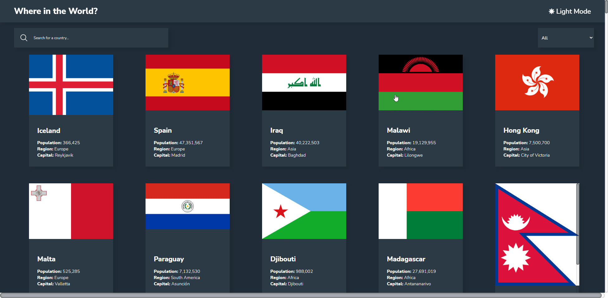

# REST Countries API Interface with theme switcher

## Table of contents

- [Overview](#overview)
  - [Requirements](#Requirements)
  - [Screenshot](#screenshot)
  - [Links](#links)
- [My process](#my-process)
  - [Built with](#built-with)
  - [What I learned](#what-i-learned)
- [Author](#author)

## Overview

### Requirements

Users should be able to:

- See all countries from the API on the homepage
- Search for a country using an input field
- Filter countries by region
- Click on a country to see more detailed information on a separate page
- Click through to the border countries on the detail page
- Toggle the color scheme between light and dark mode

### Screenshot

### Links

- Github URL: [Github](https://github.com/PedroAlexSMC/flags-project)
- Live Site URL: [Live Demo](https://countries-data-vert.vercel.app/)

## My process

### Built with

- [React](https://reactjs.org/) - JS library
- [Styled Components](https://styled-components.com/) - For styles
- React Context API
- Axios - REST Requests

### What I learned

In this project I was able to see one of many applications for using React's Context API, prop drilling can really be a pain to deal with in larger scale projects.

## Author

- Website - [Pedro Alex](https://pedroalex.tech)
- LinkedIn - [Pedro Alex](https://www.linkedin.com/in/pedroalex-costa/)
